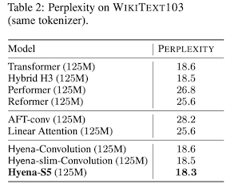

# Experimental: Language Modeling

This branch provides preliminary examples using [S5](https://arxiv.org/abs/2208.04933) for language modeling. We have 
reused the pytorch dataloading code and ported some of the pytorch source from the [Safari: Convolutions for 
Sequence Modeling](https://github.com/HazyResearch/safari) repository into JAX, including the core code required for the Associative Recall in-context learning task 
and WikiText-103 as performed in the [H3](https://arxiv.org/abs/2212.14052) and 
[Hyena](https://arxiv.org/abs/2302.10866) papers. The training loop implementation of this branch was inspired by the [TECO](https://github.com/wilson1yan/teco) repository.  

We hope to continue to add experiments on larger datasets and plan to merge the infrastructure developed in this branch (pmapping, checkpointing, more general experiment loading)
into the main branch.


## State Spaces for Language Modeling
[H3](https://arxiv.org/abs/2212.14052) proposed combining data-controlled multiplicative gating with SSMs (in particular [S4D](https://arxiv.org/abs/2206.11893)) and 
showed strong performance (when combined with a couple of attention layers in a hybrid model) on [OpenWebText](https://huggingface.co/datasets/openwebtext) , [WikiText-103](https://huggingface.co/datasets/wikitext) and the [Pile](https://pile.eleuther.ai/).
[Hyena](https://arxiv.org/abs/2302.10866) generalized the notion of multiplicative gating and also replaced the SSMs of H3 with implicitly parameterized convolutions. This latter change was because using S4D for the convolution seemed to not perform as well on 
challenging versions of synthetic in-context learning tasks (e.g. associative recall with 131K length sequences and vocab size of 30). Hyena showed strong attention-free performance and the ability to match perplexity and downstream performance of Transformers when trained on The Pile.  
A disadvantage of Hyena's implicit convolutions is that it loses the recurrent formulations (and fast autoregressive generation) that SSM methods such as S4/S5 provide.

Are the implicitly parameterized convolutions necessary and are SSM methods really not expressive enough? We were curious to just plug S5 SSMs in for the Hyena implicit convolution filters. We will refer to this as Hyena-S5
since we used the exact Hyena operator implementation (ported into JAX) and simply replaced the implicit convolutions. However,
we also note that when only order 2 operators are used (as we do here), this is essentially H3, but with S5 used instead of S4D (and a short convolution instead of H3's shift matrix).

Our results indicate that Hyena-S5 can solve the challenging associative recall in-context learning tasks and can also outperform Transformers on WikiText without any attention layers. We fully recognize that these are relatively small scale results these days, but it is at least a datapoint that S5 combined with 
multiplicative gating can potentially be very effective.  We hope to scale up these and other ideas to larger datasets soon, stay tuned! 


## Language Modeling Synthetics
Use these commands to run Hyena and Hyena-S5 on the 131K sequence length, vocab size 30 and 40 associative recall tasks 
(be sure to fill out the data_dir and wandb info in the corresponding config file):

### Small cpu test
You can run a small test (seq_len=20, vocab=10) that should run on a cpu by running this command:
```commandline
python train.py -o output_dir_name -c configs/hyena_S5/associative_recall_20_10_S5.yaml
```

### Associative Recall, 131K, vocab=30

Hyena
```commandline
python train.py -o output_dir_name -c configs/hyena/associative_recall_131K_30_hyena.yaml
```

Hyena-S5
```commandline
python train.py -o output_dir_name -c configs/hyena_S5/associative_recall_131K_30_S5.yaml
```

We averaged Hyena-S5 over 10 random seeds and obtained an average accuracy of 97.2%, which matches the performance reported for 
Hyena with implicit convolutions. For comparison we have added our result to the table from the Hyena paper: 


See an example wandb run for both Hyena and Hyena-S5 [here](https://api.wandb.ai/links/jimmysmith1919/15am8usz). 


### Associative Recall, 131K, vocab=40
We also include runs for the vocab 40 setting. 

Hyena
```commandline
python train.py -o output_dir_name -c configs/hyena/associative_recall_131K_40_hyena.yaml
```

Hyena-S5
```commandline
python train.py -o output_dir_name -c configs/hyena_S5/associative_recall_131K_40_S5.yaml
```
See an example wandb run for both Hyena and Hyena-S5 [here](https://api.wandb.ai/links/jimmysmith1919/jful23a1). 


## WikiText-103
Run these commands to run Hyena and Hyena-S5 on Wikitext-103:

Hyena
```commandline
python train.py -o output_dir_name -c configs/hyena/wikitext_hyena.yaml
```

Hyena-S5
```commandline
python train.py -o output_dir_name -c configs/hyena_S5/wikitext_S5.yaml
```

See an example wandb run for both Hyena and Hyena-S5 [here](https://api.wandb.ai/links/jimmysmith1919/ddfhke4q). 
Hyena-S5 achieves 18.3 perplexity after 100K steps. For comparison, we have added our result to the table from the Hyena paper:




Please reach out if you have any questions or feedback.

-- The S5 authors.

